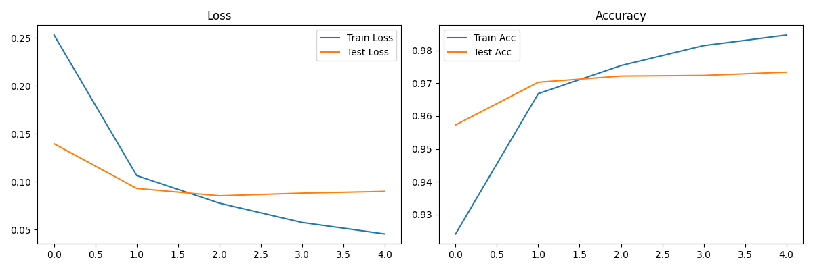
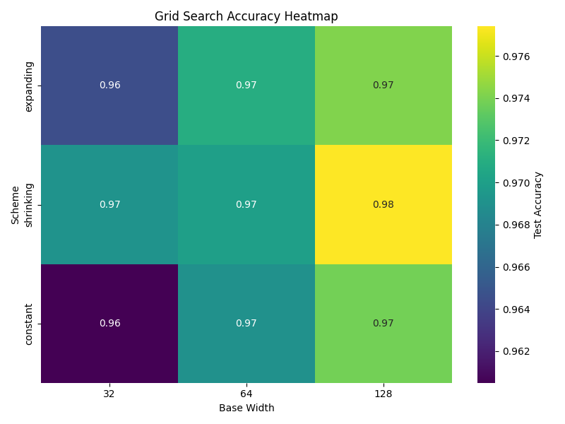

## Анализ графиков

#  Задание 1: Эксперименты с глубиной полносвязной сети

## Цель

Проверить, как глубина нейронной сети влияет на качество классификации и переобучение.  
Эксперименты проведены на датасете **MNIST** с использованием полносвязных сетей.

---

## Графики обучения

Пример графика (depth=3)

---

## Анализ

-  **Недообучение** при глубине 1 — точность низкая.
-  **Оптимальная глубина — 2**: модель достигает максимальной точности без переобучения.
-  **Переобучение** наблюдается при глубинах 3 5 и 7: train accuracy почти 100%, но test падает.
-  **Dropout и BatchNorm** улучшили стабильность при глубине 3+
-  **Сложность и время** сильно растут с глубиной.

---

# Задание 2.1 Эксперименты с шириной сети

## Сравнение моделей разной ширины

| Widths           | Training Time (sec) | Final Test Accuracy | Number of Parameters |
|------------------|---------------------|---------------------|----------------------|
| [64, 32, 16]     | 90.95               | 0.9703              | 53,018               |
| [256, 128, 64]   | 93.74               | 0.9759              | 242,762              |
| [1024, 512, 256] | 149.41              | 0.9806              | 1,462,538            |
| [2048, 1024, 512] | 267.98              | 0.9769              | 4,235,786            |

---

### Анализ

- **Время обучения** растет с увеличением ширины слоев, что ожидаемо, так как модели с большим количеством параметров требуют больше вычислительных ресурсов.
- **Точность модели** повышается при увеличении ширины, достигая максимума на ширине `[1024, 512, 256]` с точностью 0.9806. При дальнейшем увеличении ширины точность незначительно падает, возможно, из-за переобучения или сложности оптимизации.
- **Количество параметров** экспоненциально увеличивается с ростом ширины слоев, что сильно влияет на время обучения и требования к памяти.

**Вывод:**  
Оптимальным балансом между точностью и временем обучения является ширина `[1024, 512, 256]`. Она обеспечивает наилучшую точность при умеренных временных затратах и количестве параметров. Более широкие модели увеличивают вычислительную нагрузку без заметного улучшения качества.

---
# Задание 2.2  Оптимизация архитектуры (Grid Search)

В этом эксперименте мы использовали разные схемы изменения ширины нейронной сети с фиксированной глубиной (3 слоя):

- **Expanding**: [base, base × 2, base × 4]
- **Shrinking**: [base × 4, base × 2, base]
- **Constant**: [base, base, base]

Были протестированы значения `base` = 32, 64, 128.

### Результаты (Heatmap)

### Анализ результатов

**Вывод**:  
Наилучшую точность показала схема **Shrinking** при `base=128`. Это указывает, что постепенное расширение к выходу даёт модели больше обучающей мощности.

# 3.1 Эксперименты с регуляризацией

### Цель

Исследовать влияние различных техник регуляризации на обучение и качество модели.

### Использованные техники регуляризации

- Без регуляризации  
- Dropout с коэффициентами: 0.1, 0.3, 0.5  
- Batch Normalization (BatchNorm)  
- Dropout + BatchNorm  
- L2 регуляризация (weight decay = 0.01)  

### Результаты

| Метод регуляризации         | Тестовая точность | Комментарии                                      |
|----------------------------|-------------------|-------------------------------------------------|
| Без регуляризации           | 97.21%            | Быстрое сходство, но возможен риск переобучения |
| Dropout 0.1                | 96.97%            | Легкая регуляризация, стабильное обучение        |
| Dropout 0.3                | 97.06%            | Хороший баланс между регуляризацией и обучением  |
| Dropout 0.5                | 96.21%            | Сильная регуляризация, обучение идет медленнее   |
| BatchNorm только           | 97.96%            | Улучшение стабильности и точности                 |
| Dropout 0.3 + BatchNorm    | 97.28%            | Сочетание техник для сбалансированной регуляризации |
| L2 регуляризация (wd=0.01) | 96.07%            | Помогает бороться с переобучением, но менее эффективно чем BatchNorm |

### Выводы

- BatchNorm значительно улучшает стабильность обучения и итоговую точность модели.  
- Dropout с умеренными коэффициентами (0.1–0.3) помогает избежать переобучения, при этом не снижая точность.  
- Сильный Dropout (0.5) ухудшает результаты и замедляет обучение.  
- L2 регуляризация даёт небольшой положительный эффект, но уступает BatchNorm.  
- Комбинация Dropout и BatchNorm объединяет преимущества обеих техник и показывает хорошие результаты.

### Визуализация

Все графики сохранены в папке `plots/`:

- `*_history.png` — графики потерь и точности по эпохам для каждого метода.  
- `*_weights.png` — распределение весов после обучения, демонстрирующее влияние регуляризации.  
