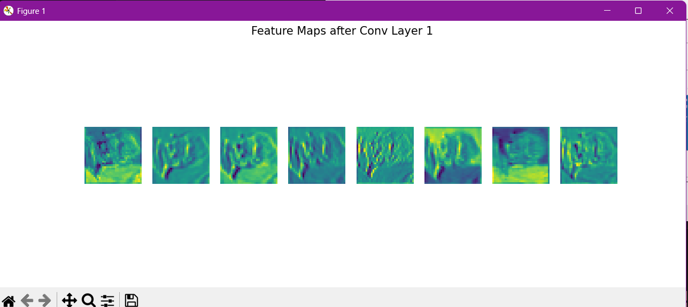

"""
# Домашнее задание 4

## — Задание 1.1: Сравнение CNN и полносвязных сетей на MNIST

В этом задании мы сравниваем производительность трёх моделей на наборе данных MNIST:

- Полносвязная сеть (FCNet).
- Простая сверточная сеть (SimpleCNN).
- CNN с Residual Block (CNNWithResidual).

## Проведённые эксперименты

- Обучение каждой модели на train-сете MNIST.
- Оценка точности на train и test множествах.
- Измерение времени обучения и времени инференса (вычисления вывода).
- Визуализация кривых обучения (loss и accuracy).
- Подсчёт количества обучаемых параметров.

---

## Результаты

| Модель          | Параметры | Время инференса (мс) | Точность (train) | Точность (test) |
|-----------------|-----------|----------------------|------------------|-----------------|
| FCNet           | 242,762   | 0.13                 | 0.9855           | 0.9792          |
| SimpleCNN       | 421,642   | 0.43                 | 0.9921           | 0.9917          |
| CNNWithResidual | 160,906   | 2.07                 | 0.9929           | 0.9928          |

---

## Графики обучения

### FCNet

### SimpleCNN

### CNNWithResidual

---

### Анализ:
- CNN архитектуры дают намного лучшую точность, чем полносвязные.
- Residual блоки позволяют достичь максимальной точности и стабилизировать обучение.
- FCNet — самая быстрая, но уступает по качеству.
- SimpleCNN — Оптимальный выбор!!!!!!.
- CNNWithResidual — лучший выбор по качеству, но самая медленная.

---

## Вывод

Сверточные архитектуры, особенно с Residual связями, являются наиболее подходящим выбором для задач компьютерного зрения на изображениях. FC-сети могут быть использованы, когда критична скорость и простота, но в современных задачах почти всегда проигрывают.

---
## Задание 1.2: Сравнение на CIFAR-10

### Цель:
Сравнить эффективность различных архитектур на более сложном датасете CIFAR-10.

### Участвующие модели:
| Модель               | Параметры  | Время инференса | Train Acc | Test Acc |
|----------------------|------------|-----------------|-----------|----------|
| `DeepFCNet`          | 3805450    | 0.65 ms         | 35.9%     | 39.2%    |
| `CNNWithResidual`    | 161482     | 2.17 ms         | 82.5%     | 79.9%    |
| `CNNWithResidualReg` | 327882     | 2.86 ms         | 67.8%     | 71.8%    |

### Анализ:

- **DeepFCNet** показала низкую точность (< 40%), несмотря на огромное количество параметров (3.8 млн). Это демонстрирует ограниченность полносвязных сетей при работе с изображениями.
- **CNNWithResidual** существенно эффективнее: при ~25x меньшем числе параметров достигается почти 80% точности. Residual блоки улучшают сходимость и обучение.
- **CNNWithResidualReg** обучалась медленнее, но регуляризация улучшила обобщающую способность модели (меньше переобучения), что дало более высокую `Test Acc` по сравнению с `Train Acc`.

### Выводы:
- Для обработки изображений, особенно на более сложных датасетах, **CNN являются предпочтительным выбором**.
- Использование **Residual блоков** значительно повышает точность и стабильность обучения.
- Регуляризация помогает избежать переобучения, пусть и ценой медленного обучения.
- Полносвязные сети на CIFAR-10 работают **плохо и неэффективно**.

## Графики обучения

### DeepFCNet

### CNNWithResidual

### CNNWithResidualReg

---

---

## Задание 2.1 — Влияние размера ядра свёртки

### Цель

Сравнить архитектуры CNN с различными размерами ядер свёртки при сохранении примерно одинакового количества параметров. Проверить влияние на точность, время инференса и рецептивное поле.

---

### Сводная таблица

| Model            | Parameters | Inference (ms) | Train Accuracy | Test Accuracy |
|------------------|------------|----------------|----------------|---------------|
| **CNN3x3**        | 60,362     | 0.48           | 77.21%         | **71.52%**    |
| **CNN5x5**        | 34,538     | 0.67           | 72.83%         | 68.50%        |
| **CNN7x7**        | 17,722     | 0.67           | 66.39%         | 65.11%        |
| **CNN1x1+3x3**    | 65,226     | 0.74           | 72.29%         | 67.02%        |

---

### Вывод

- **CNN с ядрами 3×3** показала наилучшую точность. Это типичный и проверенный вариант для большинства CNN (как в VGG, ResNet и др.).
- **Большие ядра (5×5 и 7×7)** оказались менее эффективными: хуже обрабатывают локальные детали и уменьшают количество фильтров при равных параметрах.
- **Схема 1×1 + 3×3** работает близко по эффективности к обычному 3×3, но чуть уступает по точности.
- **Время инференса** также растёт при увеличении ядра или добавлении комбинаций.

---

## Графики обучения

### CNN3x3

### CNN7x7

---

## 2.2 Влияние глубины CNN

### Цель
Изучить, как глубина сверточной нейросети влияет на:
- точность классификации,
- скорость инференса,
- стабильность градиентов,
- визуальные признаки на feature maps.

Модели:
- **ShallowCNN** — 2 слоя
- **MediumCNN** — 4 слоя
- **DeepCNN** — 6+ слоев
- **ResNetLikeCNN** — с residual связями

### Результаты

| Модель           | Параметры | Время инференса (ms) | Точность (Train) | Точность (Test) |
|------------------|-----------|----------------------|------------------|-----------------|
| ShallowCNN       | 60,362    | 1.72                 | 0.7181           | 0.6925          |
| MediumCNN        | 322762    | 3.78                 | 0.7852           | 0.7547          |
| DeepCNN          | 368938    | 2.43                 | 0.7373           | 0.7295          |
| ResNetLikeCNN    | 151818    | 3.79                 | 0.7537           |  0.7326         |

### Анализ

- **ShallowCNN** — самая быстрая модель с наименьшим числом параметров. Однако точность на тесте ограничена из-за малой глубины и недостатка абстракции.
- **MediumCNN** — показывает наилучшую точность на тестовой выборке. Увеличение глубины дало прирост качества, несмотря на увеличение времени инференса.
- **DeepCNN** — глубже, но не лучше: прирост точности оказался ниже, а переобучение немного сильнее (train acc падает).
- **ResNetLikeCNN** — хотя глубина выше, residual-связи позволили добиться стабильности градиентов и точности, сопоставимой с DeepCNN, но при меньшем количестве параметров.

### Градиенты (некоторые графики, все лежат в папке plots)

#### ShallowCNN

#### MediumCNN

### Визуализация Feature Maps

#### ShallowCNN

#### MediumCNN

#### DeepCNN

#### ResNetLikeCNN

### Выводы

- Глубина влияет на способность сети извлекать сложные признаки, но **слишком глубокие сети без residual-связей могут страдать от затухающего градиента**.
- **Residual-связи помогают сохранить стабильность при обучении более глубоких моделей**, особенно когда рост параметров нежелателен.
- Лучший баланс точности и объема модели показывает **MediumCNN**, но **ResNetLikeCNN** выигрывает в устойчивости и эффективности.

---

## 3.1 Анализ кастомных слоёв

### Сравнительная таблица

| Слой                | Output Shape         | Grad Mean (Input)       | Grad Mean (Weights)      | Время (100 итераций) | Комментарий                                               |
|---------------------|----------------------|--------------------------|---------------------------|-----------------------|------------------------------------------------------------|
| **Swish**           | `[4, 3, 32, 32]`     | ~4.09e-05                | —                         | ~0.0033 сек           | Плавная активация, немного медленнее, чем ReLU             |
| **ReLU**            | `[4, 3, 32, 32]`     | ~4.08e-05                | —                         | ~0.0020 сек           | Стандарт, быстрее Swish, но без "гладкости"                |
| **L2Pooling**       | `[4, 3, 16, 16]`     | ~2.11e-07                | —                         | —                    | Альтернатива MaxPool, даёт более сглаженное поведение      |
| **MaxPool2d**       | `[4, 3, 16, 16]`     | —                        | —                         | —                    | Классический пулинг, быстрее и проще                        |
| **CustomConv**      | `[4, 16, 32, 32]`    | ~1.67e-05                | ~0.00103                  | —                    | Свёрточный слой с дополнительным усреднением по каналам     |
| **ChannelAttention**| `[4, 16, 32, 32]`    | ~7.11e-06                | ~0.00156 (через CustomConv) | —                  | Усиление важных каналов, применяется после свёртки         |

---

### Вывод

- **Swish** — более плавная функция активации, чем ReLU. Работает чуть медленнее, но даёт похожие градиенты.
- **L2Pooling** — альтернатива MaxPooling. Даёт более «мягкое» сжатие, может помочь избежать переобучения.
- **CustomConv** — обычная свёртка + усреднение по каналам. Работает стабильно, градиенты считаются правильно.
- **ChannelAttention** — усиливает важные каналы, полезен в глубоких сетях. Также прошёл проверку на обратное распространение.

---

## 3.2 Эксперименты с Residual блоками

### Цель

Исследовать производительность и поведение различных вариантов Residual-блоков:

- **BasicResidualBlock** — классический residual-блок из двух сверточных слоёв.
- **BottleneckBlock** — компактный блок с 1×1, 3×3 и 1×1 свёртками.
- **WideResidualBlock** — увеличенная ширина каналов для повышения производительности.

### Результаты тестов

| Блок               | Параметров | Время (100 прогонов) | Средний градиент | Размер выхода         |
|--------------------|------------|-----------------------|------------------|------------------------|
| BasicResidualBlock | 74,112     | 2.08 сек              | 4.76e-07         | `[4, 64, 32, 32]`       |
| BottleneckBlock    | 4,640      | 0.75 сек              | 9.53e-07         | `[4, 64, 32, 32]`       |
| WideResidualBlock  | 230,528    | 5.52 сек              | 9.53e-07         | `[4, 128, 32, 32]`      |

### Анализ

- **BasicResidualBlock** — сбалансирован по скорости и числу параметров, универсален.
- **BottleneckBlock** — лёгкий и быстрый, идеально подходит для глубоких сетей.
- **WideResidualBlock** — требует больше ресурсов, но может захватывать больше признаков.

### Вывод

Все блоки успешно реализованы и корректно работают в `forward` и `backward` проходах.

- **Bottleneck** — наилучший выбор при ограниченных ресурсах.
- **WideResidual** — подходит, если приоритет — точность, а не скорость.
- **BasicResidual** — хорошее соотношение производительности и сложности.

