# Домашнее задание 1: Стандартные аугментации torchvision

## Ход решения

- Загрузили датасет `CustomImageDataset` из `data/train`.
- Выбрали по одному изображению из 5 разных классов.
- Создали стандартные аугментации: `RandomHorizontalFlip`, `RandomCrop`, `ColorJitter`, `RandomRotation`, `RandomGrayscale`.
- Применили каждую аугментацию к выбранным изображениям и визуализировали результаты.
- Показали все аугментации сразу на одном изображении.
- Создали комбинированный пайплайн со всеми аугментациями и применили к 5 изображениям.

---

#### Гароу

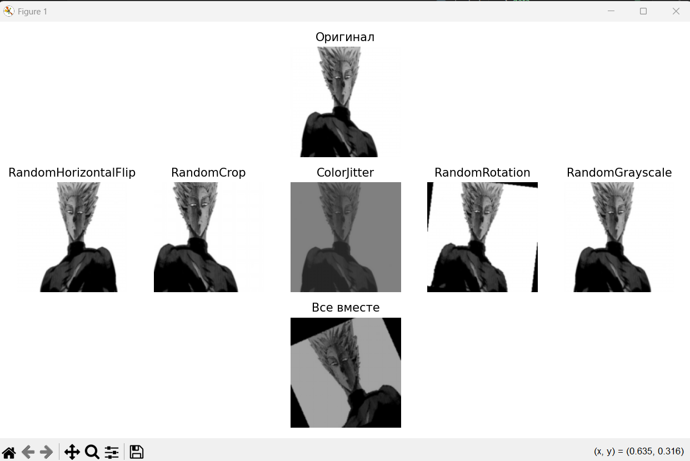

#### Генос

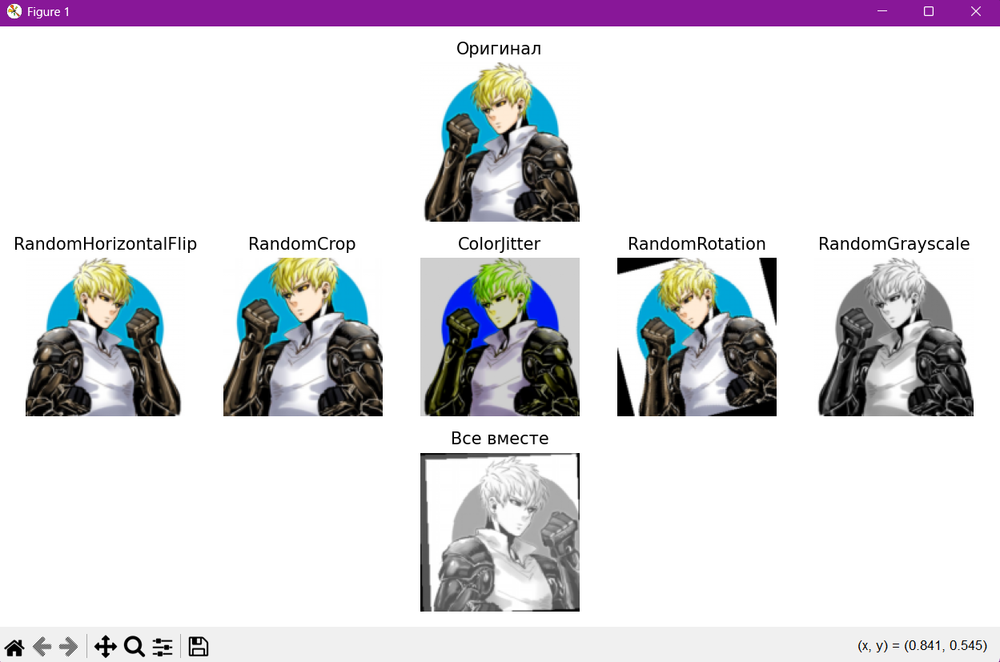

#### Сайтама

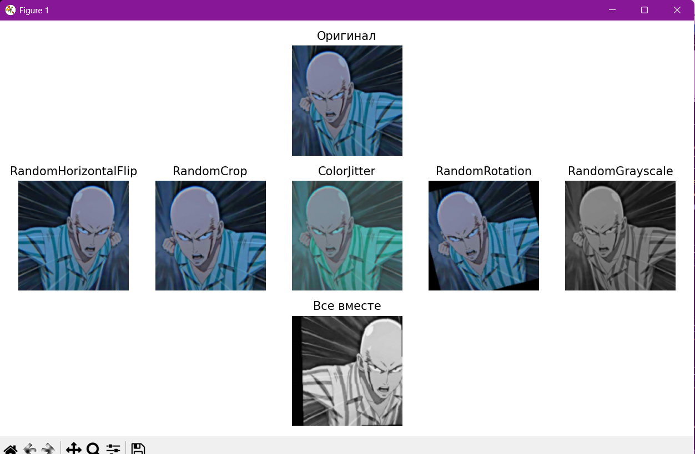

#### Соник

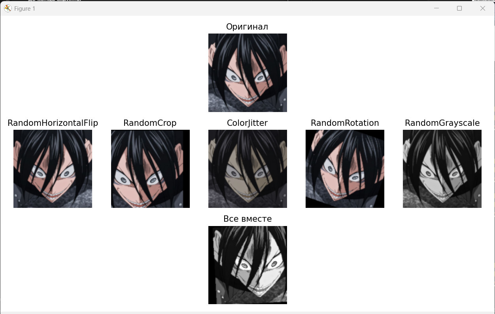

#### Татсумаки

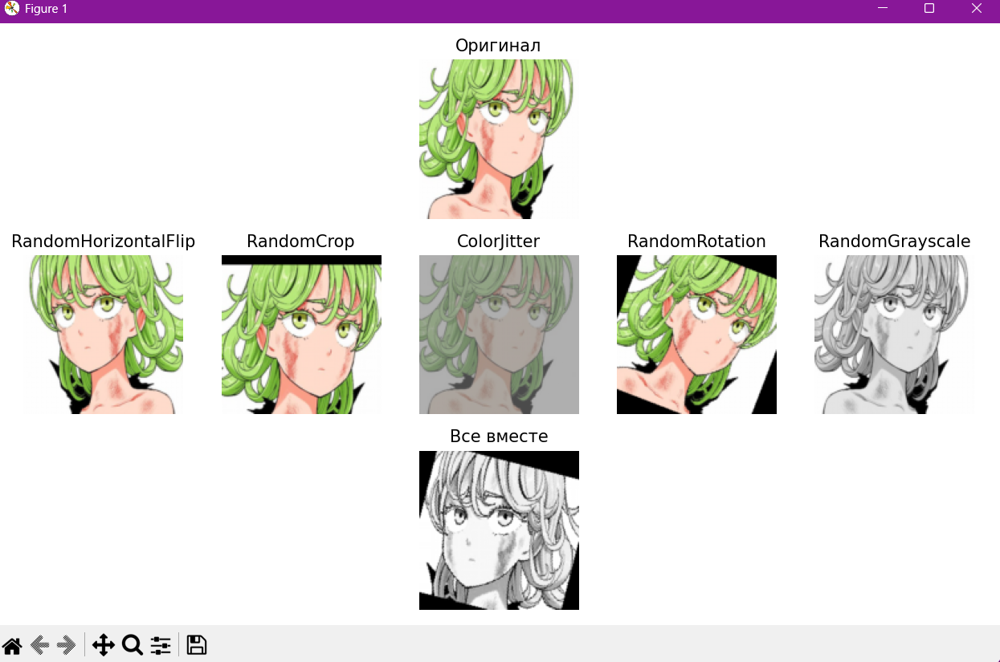

## Анализ и выводы

- Каждая аугментация вносит заметные изменения, улучшая разнообразие данных.
- Комбинация аугментаций помогает сделать данные более вариативными и устойчивыми к изменениям.
- Такие аугментации полезны для повышения качества обучения моделей.

---

## Задание 2: Кастомные аугментации

Были реализованы 3 собственные аугментации:
- `RandomBlur`: добавляет размытие
- `RandomPerspective`: искажает форму изображения
- `RandomBrightnessContrast`: изменяет яркость и контрастность

Для сравнения использовались готовые:
- `AddGaussianNoise`
- `CutOut`
- `AutoContrast`

#### Татсумаки

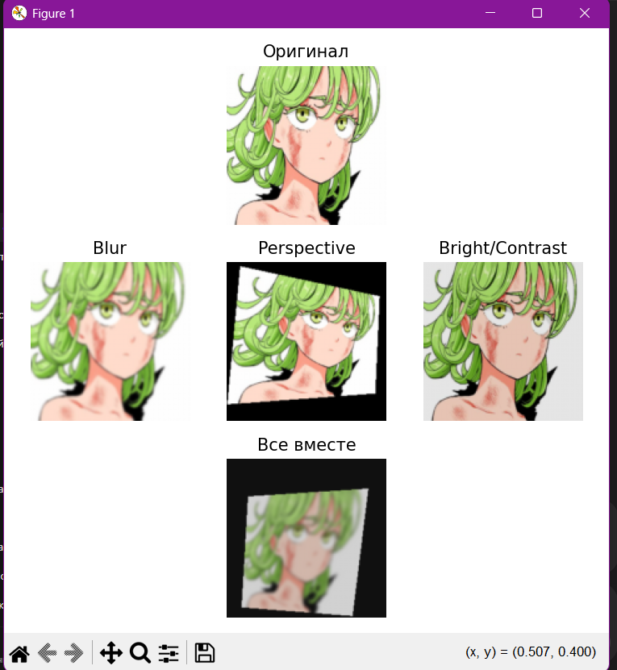

#### Татсумаки extra_augs.py

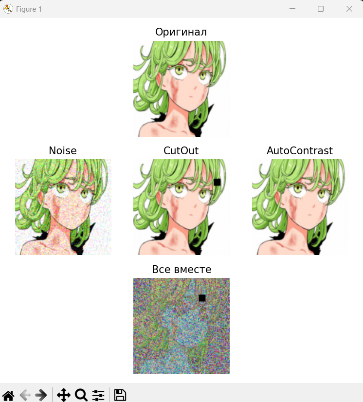

Визуально сравнили пары аугментаций по эффекту.  
Собственные аугментации вносят более контролируемые и мягкие изменения,  
в то время как `CutOut` и `Noise` работают более агрессивно.

Комбинации аугментаций дают вариативные, но семантически сохранённые изображения.

---

## Задание 3: Анализ датасета

В ходе анализа датасета были получены следующие результаты:

- Количество изображений в каждом из 6 классов одинаково и составляет по 30 экземпляров, что говорит о сбалансированности выборки.
- Минимальный, максимальный и средний размеры изображений совпадают и равны 224x224 пикселей, что упрощает предобработку данных и исключает необходимость масштабирования.
- Гистограммы распределения размеров и количества изображений по классам подтверждают равномерность и однородность датасета.

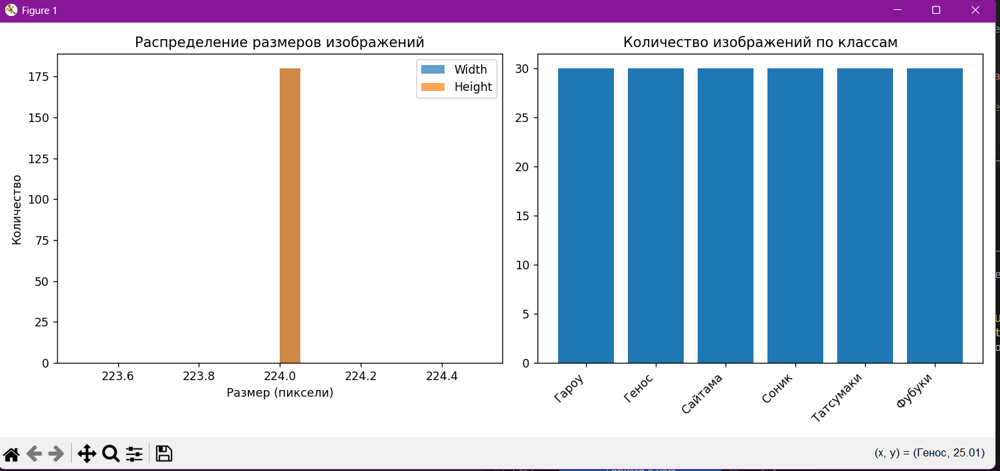

**Вывод:** Датасет является сбалансированным и стандартизированным по размеру изображений, что способствует эффективному обучению модели и снижает риск переобучения из-за дисбаланса классов или вариаций размеров входных данных.

---

## Задание 4: Pipeline аугментаций

**Цель:** Реализовать гибкую систему управления аугментациями и протестировать различные уровни их интенсивности на изображениях.

### Реализация:
- Создан класс `AugmentationPipeline` с методами:
  - `add_augmentation(name, aug)` — добавление аугментации;
  - `remove_augmentation(name)` — удаление аугментации;
  - `apply(image)` — применение всех текущих аугментаций к изображению;
  - `get_augmentations()` — просмотр списка аугментаций.

- Были созданы три конфигурации:
  - **Light**: только горизонтальное отражение.
  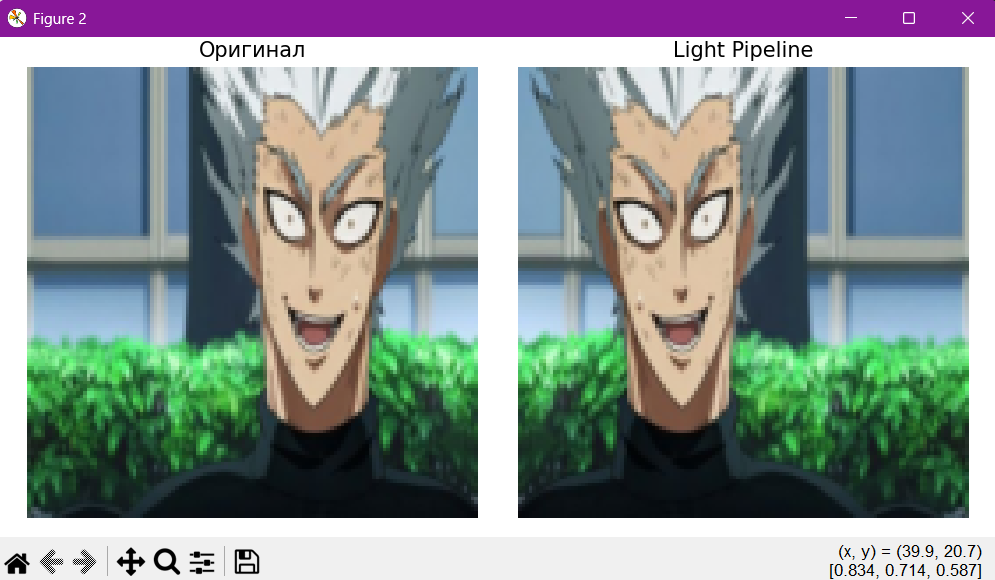

  - **Medium**: отражение + вращение.
  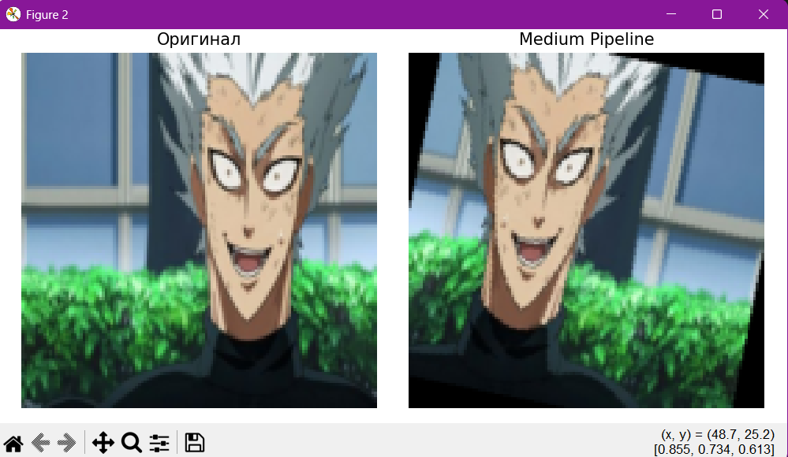

  - **Heavy**: отражение + вращение + ColorJitter.
  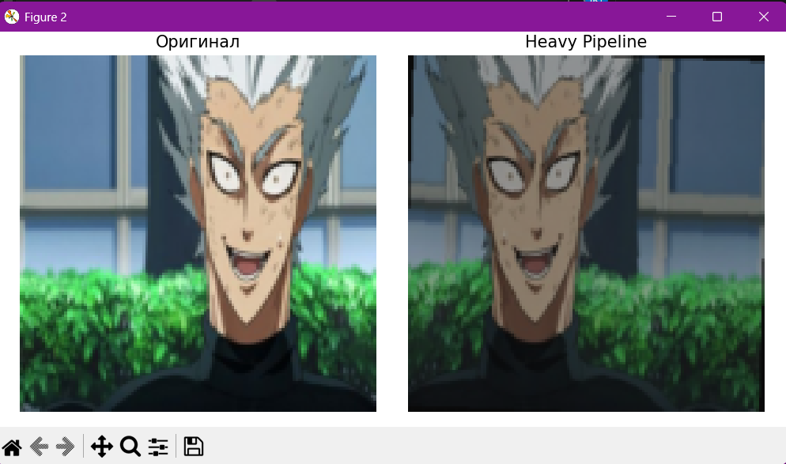

- Визуализированы результаты, демонстрирующие разную степень искажения исходного изображения.

###  Вывод:
- Класс `AugmentationPipeline` позволяет удобно управлять пайплайнами без переписывания логики.
- Чем «тяжелее» конфигурация, тем сильнее изменяется изображение — важно учитывать, чтобы не искажать семантику класса.
- Такой подход позволяет подбирать баланс между разнообразием обучающих данных и сохранением их информативности.

---

## Задание 5: Эксперимент с размерами изображений

### Проведён эксперимент с размерами:
- 64x64
- 128x128
- 224x224
- 512x512

Для каждого размера измерялись:
-  Время загрузки и аугментаций 100 изображений
-  Пиковое потребление памяти (MB)

### Результаты:

| Размер | Время (сек) | Память (MB) |
|--------|-------------|-------------|
| 64×64  | 0.82        | 0.75        |
| 128×128| 0.98        | 0.18        |
| 224×224| 1.13        | 0.33        |
| 512×512| 2.04        | 1.55        |

### Графики:
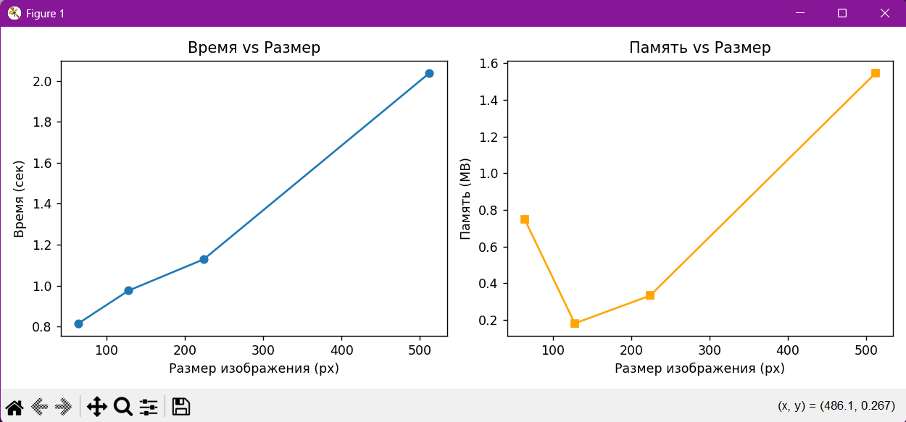

### Вывод:
- С увеличением размера изображений растёт и время обработки, и потребление памяти.
- Размер 128×128 — наиболее оптимален по скорости и ресурсам.
- Размер 512×512 обеспечивает лучшее качество, но требует в ~2 раза больше времени и памяти.

---

## Задание 6: Дообучение предобученной модели

Для дообучения была выбрана модель **ResNet18**, предобученная на ImageNet (`weights='IMAGENET1K_V1'`). Последний слой (`fc`) был заменён на полносвязный слой с числом выходов, соответствующим количеству классов в датасете (6 классов).

Модель обучалась в течение 10 эпох. Использовалась функция потерь `CrossEntropyLoss` и оптимизатор `Adam` с learning rate = 1e-3.

### Результаты обучения

- **Train Accuracy** выросла с **0.53** до **0.97**.
- **Validation Accuracy** достигла **0.84** на 8-й эпохе.
- После 5–6 эпох началось **переобучение**: обучение продолжает улучшаться, но качество на валидации ухудшается.

### Визуализация

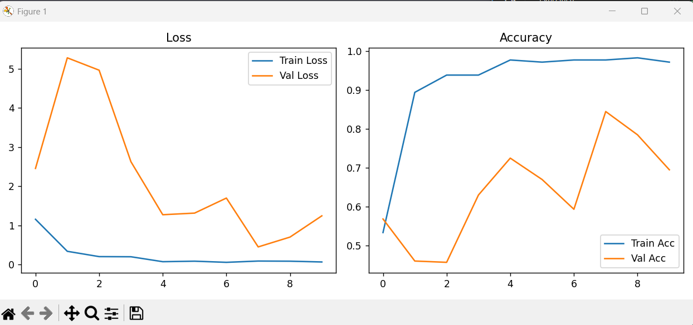