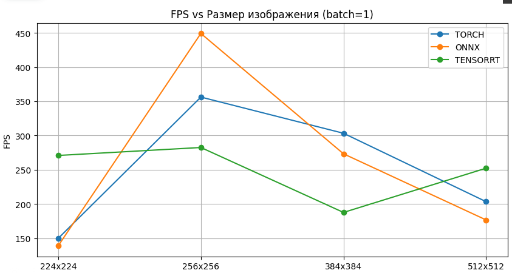
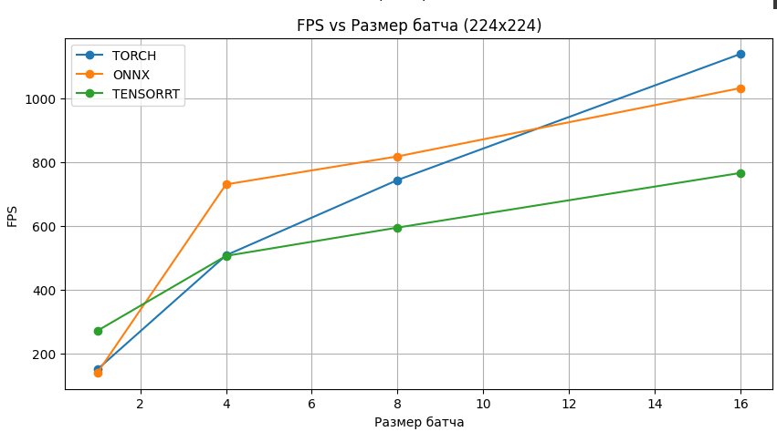
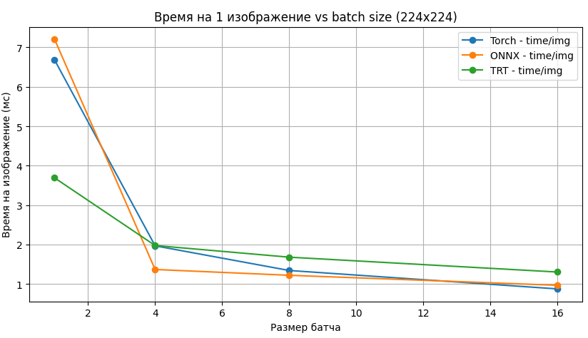
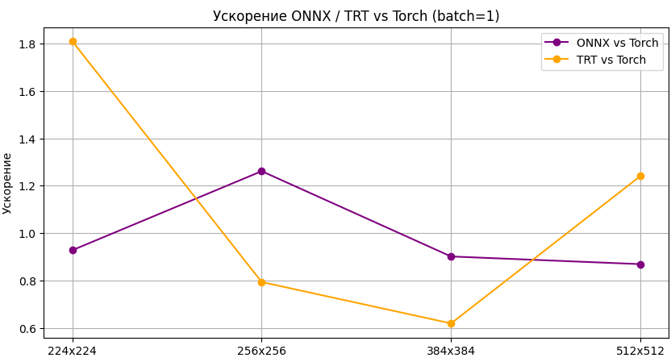
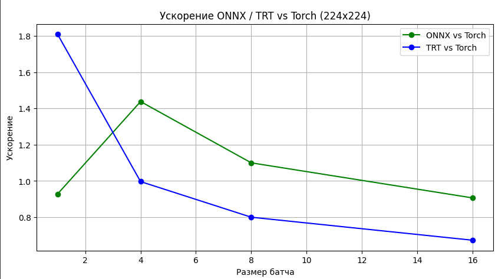
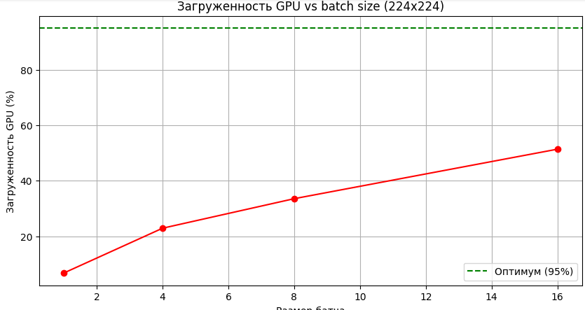

# Отчёт: Сравнение инференса PyTorch и ONNX на GPU Tesla T4

## 1. Введение

Цель: сравнить производительность ResNet18 при инференсе в PyTorch, Torch-TensorRT и ONNX-форматах на GPU Tesla T4, с учётом разных размеров изображения и batch size.

Задачи:
- Измерить FPS, latency и ускорение ONNX Torch-TensorRT по сравнению с PyTorch
- Проанализировать влияние batch size и input size
- Оценить загрузку GPU через профилирование FLOPs

## 2. Методология

**Модель:** `ResNet18`  
**Фреймворки:** PyTorch, ONNXRuntime, Torch-TensorRT 
**Размеры входов:** 224×224, 256×256, 384×384, 512×512  
**Batch sizes:** 1, 4, 8, 16  
**Повторы:** 20, с отбрасыванием крайних 10%  
**Окружение:** Google Colab, GPU: Tesla T4 (теоретические 8.1 TFLOPs)

Метрики:
- Среднее время инференса (ms)
- FPS (batch_size / latency)
- Ускорение ONNX Torch-TensorRT vs PyTorch
- Время на 1 изображение
- Загрузка GPU через FLOPs

## 3. Результаты

### Таблица производительности:

| Size     | Batch | Torch ms | ONNX ms | TRT ms | Torch FPS | ONNX FPS | TRT FPS | ONNX ↑ | TRT ↑ | Img Time (ms) | GPU Load % |
|----------|-------|----------|---------|--------|-----------|----------|---------|--------|--------|----------------|------------|
| 224x224  | 1     | 6.68     | 7.20    | 3.69   | 149.7     | 138.8    | 270.9   | 0.93   | **1.81** | 6.68          | 6.7%       |
| 224x224  | 4     | 7.88     | 5.48    | 7.91   | 507.8     | **730.2**| 505.8   | **1.44**| 1.00   | 1.97          | 22.9%      |
| 224x224  | 8     | 10.75    | 9.78    | 13.45  | **743.9** | 818.0    | 594.7   | 1.10   | 0.80   | 1.34          | 33.5%      |
| 224x224  | 16    | 14.04    | 15.50   | 20.88  | **1139.7**| 1032.5   | 766.2   | 0.91   | 0.67   | 0.88          | 51.4%      |
| 256x256  | 1     | 2.81     | **2.23**| 3.54   | 356.2     | **449.3**| 282.5   | **1.26**| 0.79   | 2.81          | 21.0%      |
| 256x256  | 4     | 8.83     | **5.95**| 8.40   | 453.1     | **672.8**| 476.0   | **1.48**| 1.05   | 2.21          | 26.7%      |
| 256x256  | 8     | 10.79    | 11.10   | 12.88  | **741.2** | 720.8    | 621.2   | 0.97   | 0.84   | 1.35          | 43.6%      |
| 256x256  | 16    | 17.01    | 20.89   | 20.52  | **940.4** | 766.0    | 779.7   | 0.81   | 0.83   | 1.06          | 55.4%      |
| 384x384  | 1     | **3.30** | 3.66    | 5.33   | **303.3** | 273.3    | 187.6   | 0.90   | 0.62   | 3.30          | 40.2%      |
| 384x384  | 4     | 14.16    | **12.37**| 13.23 | 282.6     | **323.5**| 302.4   | **1.14**| 1.07   | 3.54          | 37.4%      |
| 384x384  | 8     | 22.27    | 24.42   | 24.18  | **359.3** | 327.6    | 330.9   | 0.91   | 0.92   | 2.78          | 47.6%      |
| 384x384  | 16    | 36.98    | 40.85   | 42.97  | **432.7** | 391.6    | 372.4   | 0.91   | 0.86   | 2.31          | 57.3%      |
| 512x512  | 1     | 4.92     | 5.66    | **3.96**| 203.3     | 176.6    | **252.2**| 0.87   | **1.24**| 4.92          | 47.9%      |
| 512x512  | 4     | 19.09    | 20.69   | **17.10**| 209.6   | 193.3    | **234.0**| 0.92   | **1.12**| 4.77          | 49.3%      |
| 512x512  | 8     | 38.24    | 40.74   | **33.37**| 209.2   | 196.4    | **239.7**| 0.94   | **1.15**| 4.78          | 49.3%      |
| 512x512  | 16    | 62.39    | 70.32   | **64.82**| 256.5   | 227.5    | **246.8**| 0.89   | **0.96**| 3.90          | 60.4%      |

## 4. Графики

### 4.1 FPS vs Размер изображения (batch=1)

**Вывод:**
- FPS снижается с увеличением входного размера
- ONNX стабилен, Torch-TensorRT быстрее при 224×224

---

### 4.2 FPS vs Batch Size (224×224)

**Вывод:**
- FPS растёт с увеличением batch size
- При batch=16 — точка насыщения: прирост минимален

---

### 4.3 Время на 1 изображение (224×224)

**Вывод:**
- Torch-TensorRT быстрее на маленьких батчах
- ONNX стабильно быстрее PyTorch

---

### 4.4 Ускорение ONNX и TRT

#### По размеру изображения (batch=1)

#### По batch size (224×224)

---

### 4.5 Загрузка GPU по FLOPs

**Вывод:**
- Максимальная загрузка: ~60%
- Загрузка растёт с batch size, но не достигает 95%
- Оптимально: batch=16

### Какой подход лучше?

- **ONNX Runtime** даёт **до 1.48×** ускорения и стабилен
- **Torch-TensorRT** может быть быстрее при batch=1, но нестабилен при больших входах
- **PyTorch** — baseline, но проигрывает в latency и FPS

### Влияние размера изображения

- При увеличении размера входа — FPS падает
- Оптимально: `224x224` или `256x256`

### Влияние batch size

- FPS растёт до `batch=16`, потом — плато
- При `batch=16`: лучшая загрузка GPU и скорость

---

## 5. Заключение

- **ONNX Runtime** — лучший компромисс между скоростью, стабильностью и простотой
- **Torch-TensorRT** полезен при batch=1, но требует осторожности
- **Оптимальные параметры**: `224×224`, `batch=16`
- Использование FLOPs помогает оценить реальную загрузку GPU
- Для продакшна рекомендован ONNX, особенно при ограничениях по latency

